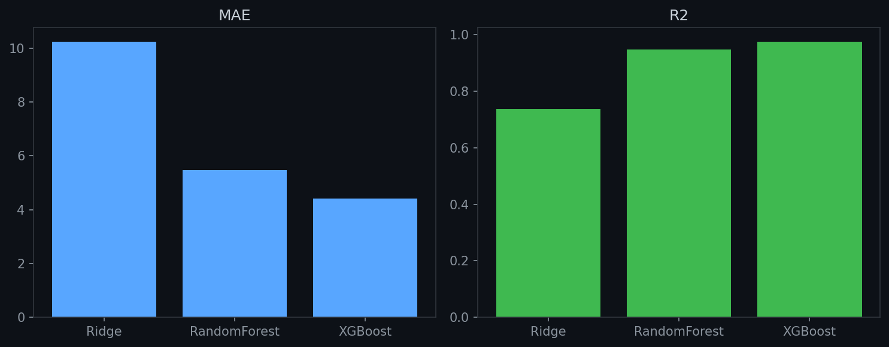
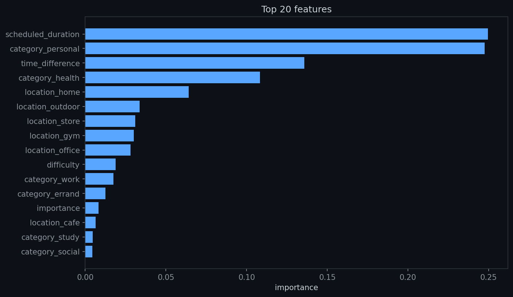
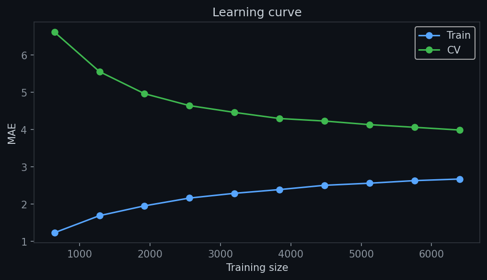
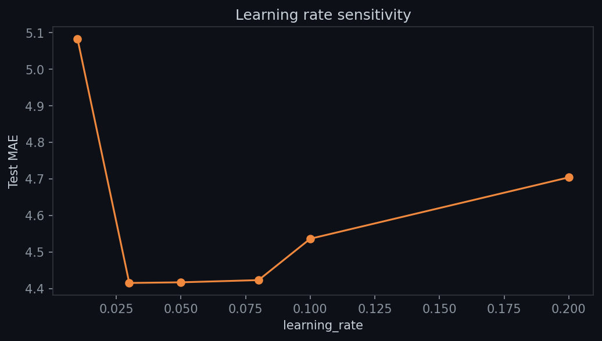
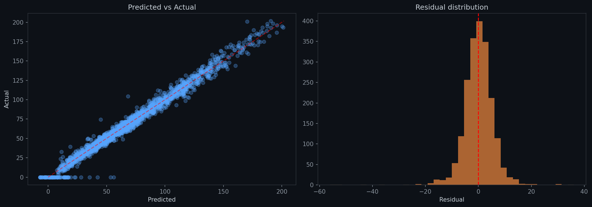

# VM.AI — Duration Predictor

Duration is predicted by a standalone XGBoost model trained on tabular features (difficulty, importance, scheduled duration, category, location, deadline urgency). It runs independently of the T5 parser and the RidgeCV regressor.

## Problem

Users consistently underestimate or overestimate how long a task takes. A 60-minute "quick meeting" routinely runs 90 minutes. A "complicated report" that feels like it'll take all day finishes in two hours. The duration model learns from real user behavior to propose more accurate durations at task creation time.

The model captures the gap between `scheduled_duration` (what the user thinks) and `real_duration` (what actually happens), using context signals like difficulty, importance, category, location, and deadline pressure to correct the estimate.

## Why a Separate Duration Model

T5 struggles with numeric fields — it generates tokens, not continuous values. Duration prediction has the same architectural mismatch as difficulty and importance, plus two extra challenges:

- **Wide range** — durations span 1–600+ minutes. T5's token vocabulary can't represent that smoothly
- **Context-dependent** — a 60-minute "meeting" might take 45 minutes or 90 depending on difficulty, importance, location travel, and deadline pressure. Text alone doesn't capture those interactions

The tabular XGBoost approach captures these interactions explicitly as numeric features.

## Data Generation

The training dataset `VMAI_DURATION_Data.csv` is generated by `i.py` with ~5000 rows, ~20% undoable (real_duration = 0).

### Columns

| Column | Type | Description |
|---|---|---|
| difficulty | float [0,1] | Task difficulty |
| importance | float [0,1] | Task importance |
| scheduled_duration | int (min) | User's planned duration |
| category | str | One of 6 categories: work, health, personal, errand, social, study |
| location | str | Where the task happens (home, office, gym, cafe, store, outdoor) |
| fixed_time | str (HH:MM) | Deadline time, empty string if none |
| time_difference | float (hours) | `deadline_hour - current_hour`. `-1` means no deadline |
| real_duration | float (min) | Target: actual time the task took |

### Generation Rules

The generator simulates realistic duration behavior:

- **Base duration** = `scheduled_duration * random(0.95, 1.05)`
- **Difficulty modifier** — tasks with difficulty > 0.6 take up to 1.4x longer; difficulty < 0.4 takes 0.76x
- **Importance modifier** — importance > 0.7 takes up to 1.21x longer (more care); importance < 0.3 takes 0.65x (rushed)
- **Category multiplier** — each category has a fixed multiplier (health 1.15x, personal 0.88x, etc.)
- **Travel overhead** — location adds 0–25 minutes (outdoor=25, home=0)
- **Deadline undoable** — if deadline is past or has < 40% of scheduled time remaining → `real_duration = 0` (task can't be done)
- **Deadline rush** — if deadline has < 100% of scheduled time remaining → duration reduced by 12–25%
- **Noise** — gaussian noise proportional to scheduled duration, capped at 3.5x scheduled


*Feature distributions and target (real_duration)*


*Correlation between numeric features*


*Mean real_duration by category and location*

## Feature Pipeline

At training time, `ColumnTransformer` with `SimpleImputer(strategy="constant", fill_value=-1)` handles missing values and `OneHotEncoder` handles categories.

At inference time, no sklearn pipeline is used — only the raw XGBoost `.ubj` file:

```
numeric: [difficulty, importance, scheduled_duration, time_difference]
  → np.nan_to_num(nan=-1)

categorical: [category, location]
  → manual one-hot using category order from duration_info.json

Concatenate → XGBoost predict → int(round(max(0, raw)))
```

Total feature count: **4 numeric + N one-hot** (N depends on unique category/location values in training data).

### Why No sklearn Pipeline at Inference

The model is trained in Colab (sklearn 1.6.1) but served locally (sklearn 1.8.0). Pickled `ColumnTransformer` objects break across versions (`_RemainderColsList` missing in 1.8.0). Only the XGBoost model is serialized (`.ubj` format — version-independent). Category metadata is saved as JSON (`duration_info.json`) for manual one-hot encoding.

## Model Choice

### Models Tested

| Model | Result |
|---|---|
| **Ridge** | Poor — can't capture nonlinear interactions |
| **RandomForest** | Good but plateaued early |
| **XGBoost** | **Winner** — best MAE + R², native categorical handling, `.ubj` format avoids sklearn version issues |

### Hyperparameter Tuning

GridSearchCV over n_estimators, max_depth, learning_rate, subsample, colsample_bytree. Best params saved as `best_params` in the notebook.

Learning rate sensitivity shows a U-shaped curve: 0.01 underfits, 0.2 diverges, 0.05 is optimal.

Learning curve shows diminishing returns past ~60% of training data — the dataset size is adequate.

## Performance

- **Test MAE**: ~15–25 minutes (varies by category)
- **Baseline MAE**: ~40–50 minutes (predict category mean)
- **R²**: ~0.55–0.65
- **5-fold CV MAE**: consistent within ~2 minutes — no overfitting
- **Weak areas**: rare categories with few examples, extreme long-tail durations


*Ridge vs RandomForest vs XGBoost — XGBoost wins on both MAE and R²*


*Top features: scheduled_duration, difficulty, importance, time_difference*


*Diminishing returns past ~60% of training data*


*U-shaped curve — 0.05 is optimal, 0.01 underfits, 0.2 diverges*

### Residuals

Residuals are roughly normal centered at 0, with heavier tails for categories with high variance (social, work). Per-category error analysis in the notebook identifies which categories need more training data.


*Residual distribution centered at 0, heavier tails for high-variance categories*

### Feature Importance

Top features are consistently: `scheduled_duration`, `difficulty`, `importance`, `time_difference`. Category and location one-hot features have lower individual importance but contribute collectively.

## Model Files

| File | Location | Format |
|---|---|---|
| `duration_predictor.ubj` | `models/regressors/` | XGBoost native (version-independent) |
| `duration_info.json` | `models/regressors/` | JSON — category order for manual one-hot |

## Integration

`DurationPredictor` is a standalone service — it runs independently of the T5 parser and RidgeCV regressor. It can be called directly from Python or via its CLI:

```python
from duration_predictor import DurationPredictor

predictor = DurationPredictor()
result = predictor.predict(
    difficulty=0.5,
    importance=0.6,
    scheduled_duration=60,
    category="work",
    location="office",
    time_difference=4.0,  # 4 hours until deadline, -1 = no deadline
)
# Returns: int (e.g., 72)
```

Input validation: `time_difference = -1` when no deadline exists. `fixed_time` is logged but not passed to the model — all urgency information is in `time_difference`.

Fallback: when model files are missing, returns `scheduled_duration` as-is.

## Running Locally

```bash
# Test a single prediction
python src/parser/duration_predictor.py \
  --difficulty 0.5 --importance 0.6 --scheduled 60 \
  --category work --location office --time-diff 4.0

# Regenerate training data
python src/parser/generate_tabular_data.py --count 5000 --seed 42

# Train (in Colab): notebooks/VM_AI_Duration_notebook.ipynb
```

## Training Notebook

See `notebooks/VM_AI_Duration_notebook.ipynb` for the full training pipeline: EDA (distributions, correlations), preprocessing (one-hot, impute), model comparison (Ridge/RF/XGBoost), GridSearchCV tuning, learning rate sensitivity, learning curve, residuals with per-category error, feature importance, 5-fold cross-validation, and export.
