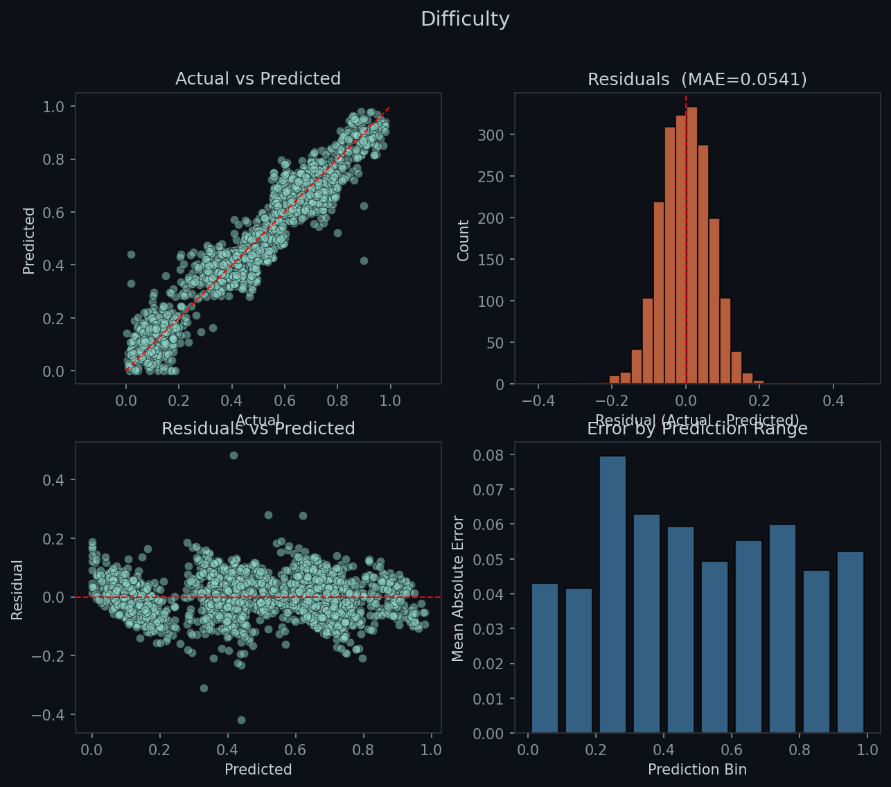
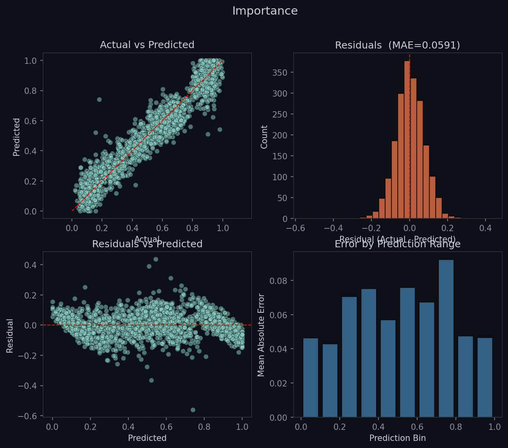
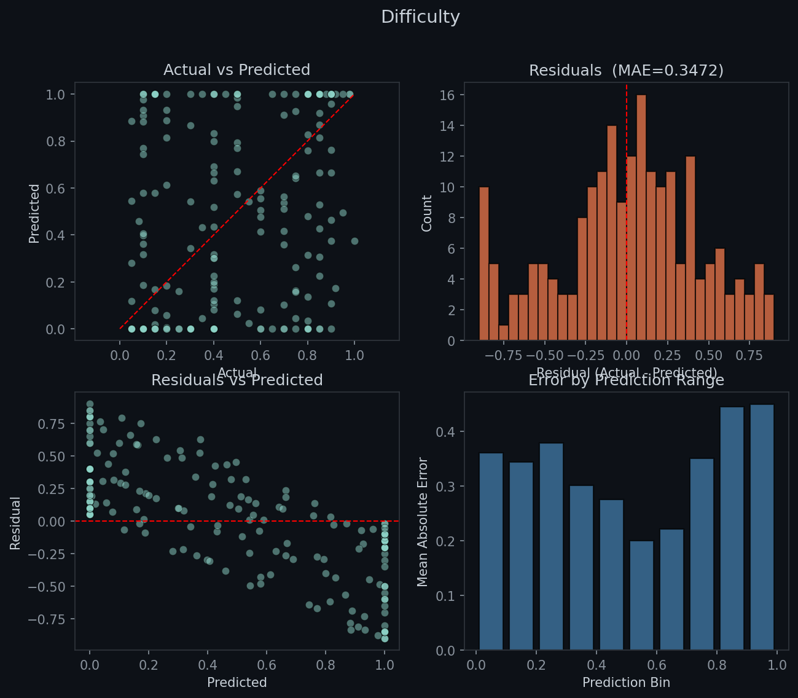

# VM.AI — Parser Module

The Parser is the first stage of the VM.AI pipeline. It takes natural language input and turns it into structured task data for the rest of the system. A fine-tuned T5-base model handles modify mode parsing, and a RidgeCV regressor predicts difficulty and importance from text embeddings. A rule-based parser handles add mode (T5 has token leakage issues there) and provides fallbacks when the regressors are unavailable.

Every field value comes with a tag: **EXP** means the user stated it, **PRD** means the model inferred it. The enrichment stage later uses this to decide which fields to overwrite with historical statistics.

## Schema

The schema has 12 fields defined in `vars.py`. Name is always explicit. Fields like difficulty, duration, category, location, importance, start, deadline, fixed_time, fixed_start, recurrent, and recurrence_days can be either EXP or PRD. Valid categories are: work, study, fitness, health, personal, finance, home, family, social, errands, travel, creative, learning, admin, shopping.

## Data Format

Fields are serialized as pipe-separated key=value pairs with tags:

```
name=gym[EXP] | difficulty=0.6[PRD] | category=fitness[PRD]
```

The `schemas.py` file handles conversion between schema dicts and this pipe format. `schema_to_pipe` iterates over all fields, normalizes values (durations to minutes, times to HH:MM, deadlines to controlled vocabulary), and produces the tagged string. `pipe_to_schema` does the reverse — it strips T5 sentinel tokens (`<extra_id_*>`), splits on `|`, parses each `field=value[TAG]`, and auto-detects missing tags by scanning the original input text for keywords.

A separate `changed_to_pipe` function does the same thing but only includes changed fields, used exclusively for modify mode output.

## Normalizers

There are four normalizers shared across generation and inference:

- **normalize_time** converts "3pm", "3:00 PM", "morning", "afternoon", "evening", "noon", "midnight" into clean HH:MM strings like "15:00" or "08:00".
- **normalize_duration** converts "1.5 hours" → "90", "30 min" → "30", "half day" → "720", "all day" → "960". Raw digit strings pass through unchanged.
- **normalize_deadline** normalizes to a small vocabulary: day names, "tomorrow", "today", "next week", "this weekend". It handles patterns like "eod" → "today", "end of week" → "this weekend", "asap" → "tomorrow", month names → "next week".
- **clamp_category** checks if a category is in the valid set, defaulting to "personal" if not.

## EXP/PRD Detection

The `detect_explicit_fields` function scans input text against keyword sets for each field type. If input contains "hard" or "easy", difficulty is EXP. If it contains "urgent" or "optional", importance is EXP. Category, duration, time, recurrence, deadline, and start all have their own keyword sets defined in `schemas.py`. Name is always marked EXP.

---

## Regressor Architecture

Difficulty (`0` = trivial, `1` = extremely hard) and importance (`0` = optional, `1` = critical) are predicted by two independent RidgeCV models.

### Why Not T5

T5 is a text-to-text model — it generates tokens, not numbers. During testing it showed three consistent problems:

- **Semantic mismatch** — "extreme" would output 0.5 while "not difficult" would output 0.85
- **Binary outputs** — everything mapped to ~0.15 ("easy") or ~0.85 ("hard") with nothing in between
- **No per-task context** — "hard homework" and "hard gym session" got identical scores

After multiple failed attempts at fixing this (data restructuring, prompt changes, architecture swaps), the regressor approach replaced the T5 predictions entirely for these two fields. The T5 model still handles category, duration, deadline, location, recurrence, and time.

### Feature Pipeline

Each input text is transformed into an 886-dimensional feature vector:

| Component | Dims | Source |
|---|---|---|
| **SBERT embeddings** | 768 | `all-mpnet-base-v2` — semantic understanding |
| **Lexical features** | 18 | negation-aware keyword counts, intensifiers, hedges, punctuation stats, digit presence |
| **TF-IDF + SVD** | 100 | TF-IDF vectorizer → TruncatedSVD reduction for latent keyword patterns |

Total: **886 features** → two RidgeCV models (one for difficulty, one for importance).

### Model Selection

Three models were tested on hand-labeled real data:

1. **XGBoost** — good performance but needed hyperparameter tuning
2. **Ridge** — simpler, comparable results
3. **RidgeCV** — same as Ridge but auto-selects alpha via cross-validation. Final winner: no tuning needed, simpler deployment, same or better metrics

### Performance

Early versions used a small dataset and produced poor results (all predictions near the mean — see `bad_model_example.png`). After expanding the training data (`*_large-datacount` vs `*_pre-ds`), the model captures meaningful variance:

- **MAE: ~0.10–0.12** — predictions off by ~10 points on a 0–100 scale
- **R²: ~0.68 (difficulty), ~0.58 (importance)** — captures ~60–70% of the variance
- Baseline (predict mean) gives MAE ~0.18 — the regressor is a clear improvement

The remaining ~30–40% un-explained variance comes from factors the text alone can't capture: user energy levels, external deadlines, mood, and personal inconsistency over hundreds of labels.


*Difficulty: predicted vs actual (large dataset)*


*Importance: predicted vs actual (large dataset)*


*Before expanding the training dataset — all predictions near the mean*

### Integration

`TaskPlannerPredictor` (in `chat.py`) loads a `RegressorPredictor` instance at startup. During both add and modify inference, the regressor predicts difficulty and importance from the raw input text. The rule-based keyword maps still exist as fallbacks when the regressor files are missing or fail to load. The regressor output is always clipped to `[0, 1]`.

Eval plots are available at `src/parser/evals/regression_evaluations/`.

---

## Data Generation

All generation lives in `data_generator.py`. The `DataGenerator` class takes parsed YAML templates and produces HuggingFace Dataset objects. It generates three kinds of data: synthetic (from templates), real (hand-written pairs), and specific (targeted examples for weak fields).

### Synthetic Data

YAML templates contain sentence patterns with placeholders like `[TASK]`, `[DURATION]`, `[DEADLINE]`, and `[LOCATION]`. The template filler picks a random template, then replaces each placeholder with a random value from the corresponding list in the YAML file. The filled sentence is the input; the output is built by the schema builder.

### Keyword Inference

Each field has a two-tier inference system. First, exact keyword match in the sentence — if found, the value is assigned and marked EXP. Second, task-type heuristic — if the task name contains "bug", difficulty is inferred as ~0.7 and marked PRD. This applies to category (40+ task→category mappings), difficulty (keyword strength map with small randomness added), importance (same pattern with urgency keywords), duration (regex for explicit mentions, then task-type defaults like gym→45min, meeting→30min, code→60min), location (phrase matching like "at the library" → "library"), and recurrence (keywords like "every", "daily" → set days).

### Schema Builder

The `_build_schema` method starts with all fields as None/False, marks each as PRD unless the field is in the explicit set, overlays any values from YAML placeholders, then runs inference for category, difficulty, importance, duration, and location. Time matches set fixed_time and fixed_start. Recurrence keywords set recurrent and recurrence_days. Deadline and start are disambiguated by keyword context — "by" and "due" suggest deadline, "start" and "begin" suggest start. If a day name appears without context, it randomly assigns to one.

### Modify Mode

Change templates define possible modifications. Each template has a field key, a phrase function (e.g. "push deadline to {value}"), and a value generator (random or fixed). There are templates for duration (4 phrasing variants), deadline (5 variants), start, location, difficulty (keyword-based phrases like "make it hard" → fixed 0.85), importance (same pattern), category, name, fixed time, and cancellations. Compound fields like `fixed_time+fixed_start` set both atomically. Cancel templates set fields to false/null.

A modify sample picks 1-3 random templates, generates values, builds the instruction sentence by joining phrases with commas, and produces pipe output with only the changed fields.

### Real & Specific Data

Real examples from `VMAI_REAL_Data.yaml` are hand-written NL→structured pairs. Specific examples from `VMAI_SPECIFIC_Data.yaml` target fields the model struggles with. Both go through `_convert_real()` which detects EXP fields from input, infers missing fields via the same keyword system, normalizes values, and produces pipe output. Modify-mode real examples use a `▌` separator between task JSON and the change instruction.

---

## Training

The training script `train.py` orchestrates everything via HuggingFace Seq2SeqTrainer with Adafactor optimizer.

### Training Modes

There are five modes. **Both** (default) generates a balanced 50/50 mix of add and modify synthetic data plus real and specific examples. **Synthetic** uses only generated data for initial runs. **Real** uses only hand-written examples for fine-tuning. **Specific** uses targeted examples plus 500 modify samples to fix weaknesses. **Modify only** generates only modify samples and requires an existing checkpoint.

### Setup

The script downloads T5-base from HuggingFace if not cached, then loads either the base model or an existing checkpoint from the output directory. Two special tokens, `[EXP]` and `[PRD]`, are added to the tokenizer so they're treated as single tokens rather than subword fragments. The model's embedding layer is resized accordingly.

The learning rate is set differently depending on whether training is fresh (0.003) or resuming (0.0003). Modify-only mode uses an even lower resume rate of 0.0001. The effective batch size is `per_device_train_batch_size * gradient_accumulation_steps`, defaulting to 32.

### Tokenization

Inputs are padded/truncated to 256 tokens, targets to 128. Padding tokens in labels are masked with -100 so the loss function ignores them.

### Metrics

After each epoch, the trainer decodes predictions and compares each field value against the ground truth. Every tracked field gets its own accuracy score, plus an overall accuracy. Tags (EXP/PRD) are stripped before comparison — only the values matter for metrics. The trainer saves checkpoints at each epoch, keeping the last 2.

---

## Inference

### Add Mode

Add mode is purely rule-based via `rule_based_add.py`. The rule-based parser strips common prefixes like "I need to", "I have to", "schedule", "remind me to". It extracts the task name by cutting off at keywords like " at ", " by ", " for ". Time is extracted by regex and normalized. Duration checks for explicit mentions first, then falls back to a task-type map (gym→45, meeting→30, code→60, study→60, etc.). Recurrence is detected from "every"/"daily"/"each". Difficulty and importance are predicted by the RidgeCV regressor when available — the keyword maps (hard→0.85, urgent→0.95, easy→0.15, optional→0.2) only apply when the regressor files are missing. Deadline is matched from "tomorrow", "next week", or day names. Location uses phrase matching. Category uses a large keyword map mapping tasks to categories. Defaults are difficulty=0.5, importance=0.5, duration=30, category="personal".

### Modify Mode

Modify mode is hybrid. The rule-based `parse_modify_rule_based` handler handles importance and difficulty changes with explicit keyword→value maps (same as add mode). The T5 model handles deadline, time, location, category, and recurrence changes. The RidgeCV regressor predicts continuous values for difficulty and importance from the modified input text. The chat script merges all three: regressor provides the numeric prediction, rules provide keyword-based overrides (e.g., "make it hard" → 0.85), and the T5 model fills everything else.

A post-generation sanity check guards against fixed_time hallucinations — if the model says fixed_time is true but the original input contains no time reference, it's reset to false. Fixe_start values are re-normalized through the normalizer.

### Interactive CLI

The `chat.py` script provides a command-line interface. Commands start with "add:" for new tasks or "modify" to change the last result. "modify json" lets you paste a task JSON and type a change instruction. Results are displayed in a formatted table showing each field, its value, and whether it was EXP or PRD. All interactions are logged to `performance_log.yaml`.

---

## Validation

The `validate_dataset.py` script checks training data consistency before training. It performs tag consistency checks (EXP fields must have corresponding keywords in input, PRD fields must not), value range validation (difficulty and importance between 0 and 1, duration non-negative, category in valid set, time in recognizable format), and duplicate detection. It produces a detailed report with per-field statistics, tag distribution counts, and error summaries grouped by type.

## Data Normalization

The `normalize_data.py` script cleans up raw YAML files before training. It converts durations to integer minutes, rounds difficulty and importance to two decimal places, clamps categories to valid values, normalizes deadlines and start dates to the controlled vocabulary, converts times to HH:MM, casts booleans properly, and filters recurrence days to valid day names. After normalization, None values are removed.

## YAML Data Files

There are three data files. **VMAI_SYNTHETIC_Data.yaml** contains templates with placeholder lists for generating synthetic training data. **VMAI_REAL_Data.yaml** contains hand-written natural language examples paired with their expected structured outputs. **VMAI_SPECIFIC_Data.yaml** has the same format as Real but targets specific weaknesses. The synthetic file is parsed by `VMAI_YamlParser` which returns a structured dataclass. The real and specific files are parsed by `VMAI_RealDataParser` which returns a list of example dictionaries.

## HF Hub Integration

The model can be uploaded to HuggingFace Hub via `upload_to_hf.py` (prompts for token, creates repo if needed, uploads ignoring checkpoints) and downloaded via `pull_from_hf.py` (always backs up the existing model first, restores backup if download fails). The repo is `vaneaa/vmai-parser`.
