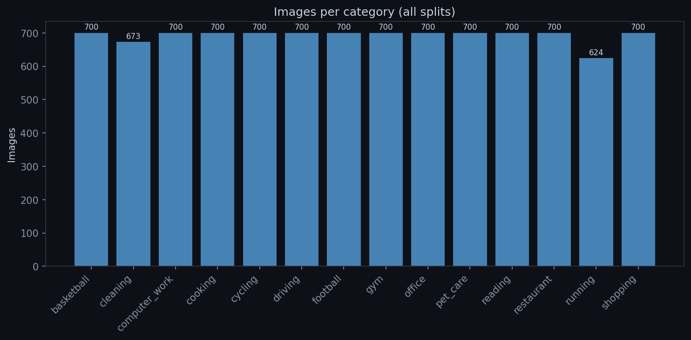

# VM.AI — Image-to-Prompt Data Collection

Downloads and prepares training images for the image-to-prompt classifier (14 activity categories, ~700 images each).

## Pipeline Overview

```
collect_data.py           →   raw/<category>/<source>/...
                               ↓  (copy, flatten, validate, dedup)
prepare_data.py           →   selected/<category>/<prefix>_<name>.jpg
download_new.py + unpack_new.py  →   selected/<category>/new_<name>.jpg  (additional Pixabay images)
dedup_selected.py         →   removes perceptual duplicates from selected/
convert_selected_jpg.py   →   ensures all selected/ images are JPEG
split_dataset.py          →   final/{train,val,test}/<category>/ + CSV
resize_final.py           →   final/ images centre-cropped + resized to 380×380
analyze_dataset.py        →   analysis report + outlier images copied to outliers/
push_dataset_to_hf.py     →   push final/ to Hugging Face Hub
pull_dataset_hf.py        →   download final/ from Hugging Face Hub
```

## Source Types

### OpenImages V7 (`fiftyone`)
Downloads images from Google's OpenImages V7 using category-specific object labels (e.g. `"Gas stove"`, `"Computer monitor"`, `"Dog"`). Labels are passed to `fiftyone.zoo.load_zoo_dataset("open-images-v7", label_types="detections", classes=[...])`. Target per category: 100–700 images depending on label count.

### Kaggle (`kagglehub`)
Four sub-handlers:
- **`kaggle`** — downloads a dataset and samples up to N images per subfolder (e.g. gym exercises, 32 per folder).
- **`kaggle_csv`** — downloads a dataset, reads a CSV, filters to rows matching a label (e.g. `"running"`), copies matching image files.
- **`kaggle_subfolder`** — downloads a dataset and uses a specific subfolder path (e.g. `HAR/train/running`).
- **`kaggle_csv_multi`** not implemented — use `kaggle_csv` with `filter_values` instead.

### Pixabay API (`requests`)
Searches Pixabay (CC0 license, ML-safe) with category-specific keywords. `per_page=200`, paginated up to 500 images per keyword. Filters: `orientation=horizontal`, `image_type=photo`, `safesearch=true`, `min_width=380`, `min_height=380`. Always downloads `largeImageURL` (1280px) with fallback to 960px. Rate-limit handled via `X-RateLimit-Remaining` header (pauses 60s if < 5 remaining, inter-page delay 0.5s, download timeout 10s).

## The 14 Categories

| # | Category | OpenImages | Kaggle | Pixabay Keywords | Pixabay Target |
|:--|:---------|:-----------|:------|:-----------------|:---------------|
| 1 | running | — | meetnagadia/har (800) + lumierebatalong/har (840) | person running | 400 |
| 2 | cycling | — | meetnagadia/har (800) + lumierebatalong/har (840) | cycling bicycle | 400 |
| 3 | cooking | Gas stove, Frying pan, Cutting board, Wok, Cooking spray, Kitchen utensil, Kitchenware, Slow cooker, Pressure cooker, Mixing bowl | dataclusterlabs/kitchen (400) | kitchen, cooking, cookware, kitchenware, chef stove | 500 |
| 4 | restaurant | Fast food, Kitchen & dining room table, Tableware, Coffee, Wine | kmader/food41 (900) | restaurant, cafe, restaurant inside | 300 |
| 5 | shopping | Convenience store, Cart, Plastic bag, Handbag | humansintheloop/supermarket (45) | grocery store, mall, clothes store | 1200 |
| 6 | office | Office building, Office supplies, Computer monitor, Whiteboard, Filing cabinet, Printer | sordi-ai/office (500) | office, office room, office desk | 500 |
| 7 | football | Football | ligtfeather/football-vs-rugby (900) | football | 300 |
| 8 | cleaning | Washing machine, Sink, Soap dispenser | — | cleaning, person cleaning house, mopping floor, washing dishes | 1000 |
| 9 | driving | Car, Seat belt, Land vehicle, Taxi | rightway11/state-farm-distracted (600) | person driving car, car | 200 |
| 10 | reading | Book, Bookcase | — | person reading book, reading, reading on the sofa, reading library, book, library | 2000 |
| 11 | computer_work | Computer monitor, Computer keyboard, Laptop, Computer mouse | — | person and laptop, developer coding, work in laptop | 1200 |
| 12 | basketball | — | rishikeshkonapure/sports (486) + gpiosenka/sports (169) + ponrajsubramaniian/sport (495) + mmoreaux/caltech256 (90) + sheikhzaib/sports (486) | basketball, basketball field, basketball player | 1000 |
| 13 | pet_care | Dog, Cat, Dog bed, Cat furniture | tongpython/cat-and-dog (700) | pet, person walking dog | 200 |
| 14 | gym | Dumbbell, Treadmill, Indoor rower, Stationary bicycle, Training bench, Punching bag, Horizontal bar | hasyimabdillah/workoutexercises (700) | gym workout | 200 |

## Usage

### 1. Setup

Ensure the API keys and repo IDs are set in `src/image_to_prompt/.env`:

```
PIXABAY_API_KEY="your_key_here"
PIXABAY_BASE_URL="https://pixabay.com/api/"
HF_TOKEN="your_hf_token_here"
HF_DATASET_REPO_ID="your-username/your-dataset-repo"
HF_DATASET_REPO_PRIVATE="False"
```

### 2. Collect Raw Data

```bash
uv run python src/image_to_prompt/data_collection/raw/collect_data.py
```

Runs all 14 categories. To run specific categories only:

```bash
uv run python src/image_to_prompt/data_collection/raw/collect_data.py basketball computer_work
```

Each category downloads into `data/image_to_prompt/raw/<category>/<source>/` and writes a `metadata.json`.

### 3. Prepare & Validate

```bash
uv run python src/image_to_prompt/data_collection/raw/prepare_data.py
```

Three phases:
- **Phase 0** — Deletes `selected/` if exists, recreates it, copies `raw/<category>/...` → `selected/<category>/...`
- **Phase 1** — Flattens `selected/<category>/<source>/filename.ext` → `selected/<category>/<source>_filename.ext`, removes source subdirs
- **Phase 2** — Per-image validation: opens & verifies, converts non-JPG to JPG (quality=95), removes images < 180×180. **Exact SHA256 dedup** across all categories (keeps first occurrence alphabetically). Random seed 42 for reproducibility.

### 4. Additional Downloads (Optional)

```bash
uv run python src/image_to_prompt/data_collection/selected/download_new.py
uv run python src/image_to_prompt/data_collection/selected/unpack_new.py
```

Downloads additional Pixabay images into `selected/<category>/new/` with per-image validation, then moves them to the parent folder with a `new_` prefix. Only `cleaning` and `shopping` categories have download configs. Uses a `+50` per-keyword buffer to compensate for images that fail validation (seed=42).

### 5. Deduplicate Selected

```bash
uv run python src/image_to_prompt/data_collection/selected/dedup_selected.py
```

Removes near-duplicate images within each category using perceptual hashing (`imagehash.phash`). Keeps one image per hash group, deletes the rest.

### 6. Convert to JPEG

```bash
uv run python src/image_to_prompt/data_collection/selected/convert_selected_jpg.py
```

Ensures every image in `selected/` is a valid JPEG (quality=95). Already-JPEG files are verified and skipped if valid, re-encoded if corrupted.

### 7. Split into Train/Val/Test

```bash
uv run python src/image_to_prompt/data_collection/final/split_dataset.py
```

Shuffles (seed=42), caps at 700 per category, splits 70/15/15, copies into `final/{train,val,test}/`, writes CSVs.

### 8. Resize to 380×380

```bash
uv run python src/image_to_prompt/data_collection/final/resize_final.py
```

Centre-crops every image in `final/` to a square, then resizes to 380×380 with Lanczos. Overwrites in place.

### 9. Analyze Dataset

```bash
uv run python src/image_to_prompt/data_collection/final/analyze_dataset.py
```

Runs 4 checks: class balance (chart), perceptual duplicates, ResNet18 outliers (copied to `outliers/`), and brightness distribution. Writes `analysis_report.json`.

Undocumented thresholds: class balance LOW alert `< 700`, HIGH alert `> 1200`, balance ratio target `≥ 0.70`, brightness deviation threshold `> 20` from global average. Chart DPI=150, `dark_background` style.


*Image count per category from the analysis report*

Optionally, detect outliers in `selected/`:

```bash
uv run python src/image_to_prompt/data_collection/selected/outliers_selected.py
```

Copies flagged outliers to `selected/outliers/<category>/` (ResNet18 + IsolationForest, 5% contamination, random_state=42). Categories with fewer than 10 images are silently skipped.

### 10. Push to Hugging Face Hub

```bash
uv run python src/image_to_prompt/data_collection/final/push_dataset_to_hf.py
```

Requires `HF_TOKEN`, `HF_DATASET_REPO_ID`, and optionally `HF_DATASET_REPO_PRIVATE` in `src/image_to_prompt/.env`. Pushes the complete dataset as a `DatasetDict` with `Image` and `ClassLabel` features.

### 11. Pull from Hugging Face Hub

```bash
uv run python src/image_to_prompt/pull_dataset_hf.py
```

Downloads the dataset from Hugging Face Hub into `data/image_to_prompt/final/`. Deletes the existing `final/` first, then reconstructs `{train,val,test}/{label}/{filename}.jpg` and regenerates the CSV files. `HF_TOKEN` is optional for public repos.

## Folder Structure

After the full pipeline:

```
data/image_to_prompt/
  raw/
    running/
      kaggle/
      pixabay/
      metadata.json
    ...
  selected/
    running/
      kaggle_0000.jpg
      pixabay_0000.jpg
      ...
    outliers/
      running/
        kaggle_0012.jpg
        ...
    ...
  final/
    train/
      running/
        kaggle_0000.jpg
        ...
      ...
    val/
      running/
        ...
    test/
      running/
        ...
    train.csv
    val.csv
    test.csv
  outliers/
    train_running_kaggle_0000.jpg
    ...
```

## Source Files

| File | Purpose |
|------|---------|
| `src/image_to_prompt/data_collection/raw/collect_data.py` | Download from all sources (5 handler types) |
| `src/image_to_prompt/data_collection/raw/prepare_data.py` | Copy, flatten, validate, deduplicate |
| `src/image_to_prompt/data_collection/selected/download_new.py` | Download additional Pixabay images |
| `src/image_to_prompt/data_collection/selected/unpack_new.py` | Flatten new/ downloads into parent folder |
| `src/image_to_prompt/data_collection/selected/dedup_selected.py` | Remove within-category perceptual duplicates from selected/ |
| `src/image_to_prompt/data_collection/selected/convert_selected_jpg.py` | Convert all selected/ images to JPEG |
| `src/image_to_prompt/data_collection/selected/outliers_selected.py` | Detect and copy outliers from selected/ |
| `src/image_to_prompt/data_collection/final/split_dataset.py` | Split selected/ into train/val/test |
| `src/image_to_prompt/data_collection/final/resize_final.py` | Resize final/ images to 380×380 |
| `src/image_to_prompt/data_collection/final/analyze_dataset.py` | Dataset analysis (balance, duplicates, outliers, brightness) |
| `src/image_to_prompt/data_collection/final/push_dataset_to_hf.py` | Push final/ dataset to Hugging Face Hub |
| `src/image_to_prompt/pull_dataset_hf.py` | Pull dataset from Hugging Face Hub |
| `src/image_to_prompt/.env` | API keys and config (gitignored) |
| `src/image_to_prompt/.env.example` | Template for `.env` |
