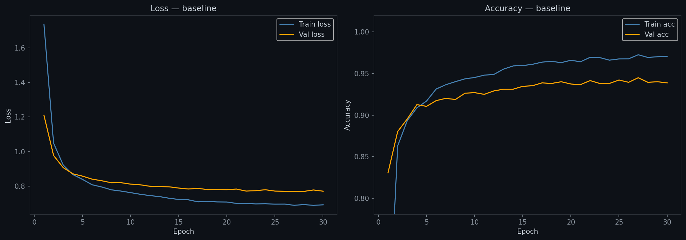
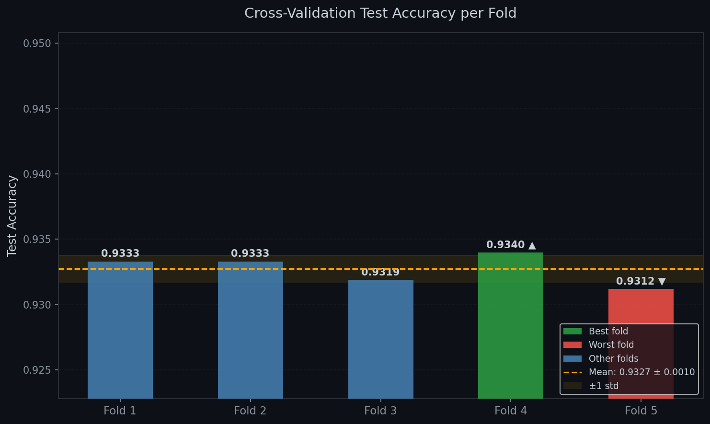
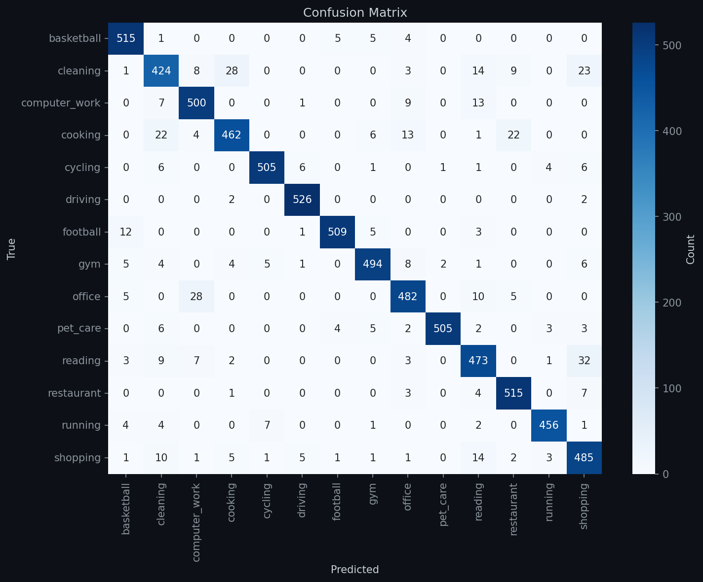
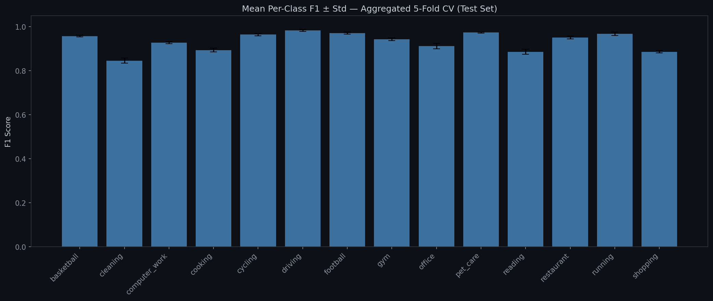
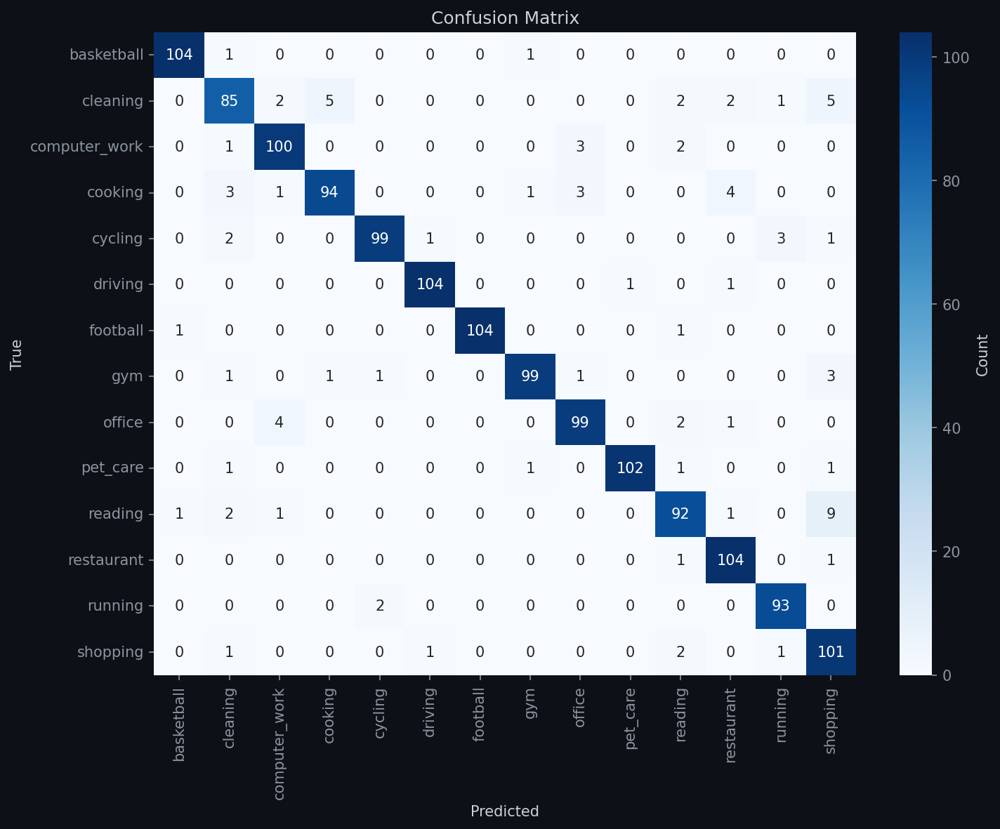
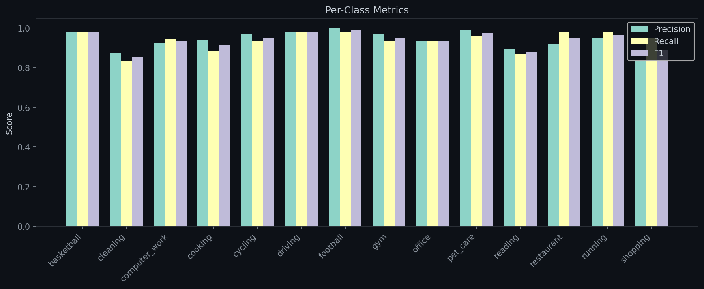
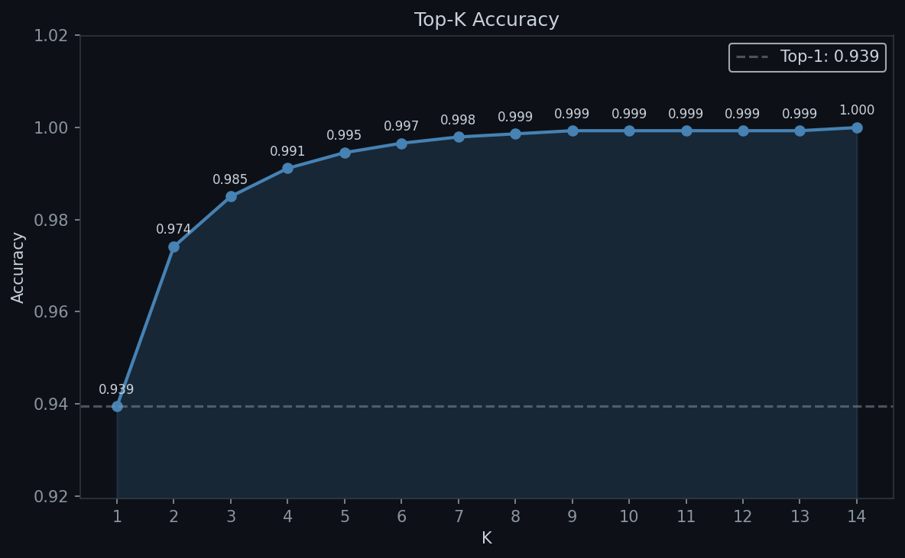

# VM.AI — Image-to-Prompt Overview

## 1. System Overview

The image-to-prompt pipeline classifies a user-submitted image into one of 14 activity categories, then maps the predicted label to a natural-language prompt template that feeds into the NLP parser.

### Architecture

```
User image → EfficientNet-B4 (380×380) → 14-class softmax → label
                                                              ↓
                                              prompt template → "I want to cook pasta..."
                                                              ↓
                                                    NLP parser → Task fields
```

### Backend Integration

The `ImgToPrompt` service (`src/backend/app/services/img_to_prompt.py`) wraps the inference logic:

- **Singleton** via `ImgToPrompt.get_instance()`
- **Eager loading** via `load()` — called by `model_loader.py` when `LAZY_LOADING=false`
- **Lazy loading** — model loads on first `predict()` call if not already loaded
- Delegates to `predict.py` for model loading and inference

---

## 2. Data Pipeline Reference

### Consolidated Thresholds

| Constant | Value | Script(s) |
|----------|-------|-----------|
| Pixabay min image size | 380 × 380 | `collect_data.py`, `download_new.py` |
| Pixabay orientation | horizontal | `collect_data.py`, `download_new.py` |
| Pixabay image type | photo | `collect_data.py`, `download_new.py` |
| Pixabay safesearch | true | `collect_data.py`, `download_new.py` |
| Pixabay per-page | 200 | `collect_data.py`, `download_new.py` |
| Pixabay download timeout | 10 s | `collect_data.py`, `download_new.py` |
| Pixabay rate-limit pause threshold | < 5 remaining | `collect_data.py`, `download_new.py` |
| Pixabay rate-limit sleep | 60 s | `collect_data.py`, `download_new.py` |
| Pixabay inter-page delay | 0.5 s | `collect_data.py`, `download_new.py` |
| JPEG quality | 95 | `prepare_data.py`, `download_new.py`, `convert_selected_jpg.py` |
| Min image dimension for validation | 180 px | `prepare_data.py`, `download_new.py` |
| Random seed | 42 | `collect_data.py`, `download_new.py`, `split_dataset.py`, `outliers_selected.py`, `analyze_dataset.py` |
| Per-keyword buffer (to compensate validation failures) | +50 | `download_new.py` |
| Max images per category in split | 700 | `split_dataset.py` |
| Split ratios | 70 / 15 / 15 | `split_dataset.py` |
| IsolationForest contamination | 0.05 (5%) | `outliers_selected.py`, `analyze_dataset.py` |
| IsolationForest random_state | 42 | `outliers_selected.py`, `analyze_dataset.py` |
| Min images for outlier detection | 10 | `outliers_selected.py`, `analyze_dataset.py` |
| Class balance LOW alert | < 700 | `analyze_dataset.py` |
| Class balance HIGH alert | > 1200 | `analyze_dataset.py` |
| Balance ratio target | ≥ 0.70 | `analyze_dataset.py` |
| Brightness deviation threshold | > 20 from global average | `analyze_dataset.py` |
| Chart DPI | 150 | `analyze_dataset.py`, `evaluate_classifier.py` |
| Chart style | `dark_background` (GitHub-dark) | `analyze_dataset.py`, `evaluate_classifier.py` |
| Evaluation `num_workers` | 0 | `evaluate_classifier.py` |
| Training `num_workers` | 2 | `train_classifier.py`, `cross_validation.py` |
| Training `pin_memory` | True (CUDA) | `train_classifier.py`, `cross_validation.py` |


*Image count per category from the analysis report*

### IMAGE_EXTENSIONS Per Stage

Extensions scanned/processed vary between pipeline stages:

| Script | Extensions | Notes |
|--------|-----------|-------|
| `collect_data.py` | `.jpg`, `.jpeg`, `.png`, `.webp` | Download sources only produce these |
| `prepare_data.py` | `.jpg`, `.jpeg`, `.png`, `.webp`, `.gif`, `.bmp`, `.tiff` | Widest — covers all possible inputs |
| `download_new.py` | `.jpg`, `.jpeg`, `.png`, `.webp`, `.gif`, `.bmp`, `.tiff` | Same as prepare |
| `unpack_new.py` | `.jpg`, `.jpeg`, `.png`, `.webp`, `.gif`, `.bmp`, `.tiff` | Same |
| `dedup_selected.py` | `.jpg`, `.jpeg`, `.png`, `.webp`, `.bmp`, `.tiff` | `.gif` excluded |
| `convert_selected_jpg.py` | `.jpg`, `.jpeg`, `.png`, `.webp`, `.bmp`, `.tiff` | `.gif` excluded |
| `outliers_selected.py` | `.jpg`, `.jpeg`, `.png`, `.webp`, `.bmp`, `.tiff` | `.gif` excluded |
| `split_dataset.py` | `.jpg`, `.jpeg`, `.png`, `.webp`, `.gif`, `.bmp`, `.tiff` | `.gif` re-included |
| `resize_final.py` | `.jpg`, `.jpeg`, `.png`, `.webp`, `.bmp`, `.tiff` | `.gif` excluded |
| `analyze_dataset.py` | `.jpg`, `.jpeg`, `.png`, `.webp`, `.bmp` | `.gif`, `.tiff` excluded |
| `push_dataset_to_hf.py` | `.jpg`, `.jpeg`, `.png`, `.webp`, `.bmp` | `.gif`, `.tiff` excluded |

### Source Handlers

The `collect_data.py` `SOURCE_HANDLERS` dict registers 4 handler types:

| Handler | Data Source | Method |
|---------|------------|--------|
| `openimages` | Google OpenImages V7 | `fiftyone.zoo.load_zoo_dataset("open-images-v7", label_types="detections", classes=[...])` |
| `kaggle` | Kaggle dataset | Random sample N images from all subfolders |
| `kaggle_csv` | Kaggle dataset with CSV | Filter CSV rows by label, copy matching images |
| `kaggle_subfolder` | Kaggle dataset, specific subfolder | Use a single subfolder path (with optional `balanced` mode) |

**Note:** `kaggle_csv_multi` is described in the data collection docs but does **not** exist in `SOURCE_HANDLERS`. The `kaggle_csv` handler with `filter_values` serves the same purpose.

### Two Dedup Stages

| Stage | Script | Algorithm | Scope | Behavior |
|-------|--------|-----------|-------|----------|
| 1 | `prepare_data.py` (Phase 2) | SHA256 (exact binary hash) | **Cross-category** | First category (alphabetical) keeps the image; delet from later categories. Tracks conflicts. |
| 2 | `dedup_selected.py` | `imagehash.phash` (perceptual hash) | **Within-category only** | Sorts paths alphabetically, first is kept. Cross-category collisions are **preserved**. |

---

## 3. Training Reference

### Hyperparameters

| Parameter | Value | Doc status |
|-----------|-------|------------|
| `num_classes` | 14 | Yes |
| `image_size` | 380 | Yes |
| `batch_size` | 32 | Yes |
| `epochs_frozen` | 5 | Yes |
| `epochs_unfrozen` | 25 | Yes |
| `lr_head` | 1 × 10⁻³ | Yes |
| `lr_backbone` | 1 × 10⁻⁵ | Yes |
| `weight_decay` | 1 × 10⁻⁴ | Yes |
| `label_smoothing` | 0.1 | Yes |
| `early_stopping_patience` | 7 | Yes |
| `early_stopping_min_delta` | 0.001 | No |
| `num_workers` | 2 | No |
| `pin_memory` | True (when CUDA) | No |
| AMP `GradScaler` | Used | No |
| Scheduler `eta_min` | 1 × 10⁻⁶ | Yes |
| `data_root` | `data/image_to_prompt/final` | No |
| `save_path` | `models/efficientnet_b4_classifier/efficientnet_b4_classifier.pth` | No |
| `device` | auto (CUDA or CPU) | No |

### Two-Phase Strategy

**Phase A — Frozen backbone (5 epochs)**
- Backbone (`model.blocks`) entirely frozen
- Only classifier head trained
- Learning rate: 1 × 10⁻³
- **No early stopping** — always runs full 5 epochs

**Phase B — Partial unfreeze (25 epochs)**
- Last 2 blocks (`model.blocks[-2:]`) + classifier unfrozen
- Learning rates: head 1 × 10⁻⁴, backbone 1 × 10⁻⁵
- Cosine annealing over 25 epochs (eta_min = 1 × 10⁻⁶)
- Early stopping: patience 7, min_delta 0.001
- AMP `GradScaler` used when CUDA available

### Checkpoint Behavior

- The best model (by `val_acc`) is always saved to the **same** file path (`efficientnet_b4_classifier.pth`), overwriting on each improvement
- There are **no epoch-specific checkpoints** (the resume example in Training.md showing `checkpoint_epoch_10.pth` does not match actual behavior)
- Resume support: loads `epoch`, `best_val_acc`, `history`, `optimizer_state_dict`, `scheduler_state_dict` from checkpoint
- On resume, Phase B starts from `max(start_epoch - epochs_frozen, 0)`

### Test Evaluation

`train_classifier.py` automatically runs test evaluation at the end of training using the best saved checkpoint — it is not a separate step. Results are saved to `training_history.json`.

### CPU Warning

When training on CPU, the script prints:
```
WARNING: Training on CPU — expected ~3 hours. Use a GPU for faster training.
```


*Training history from the baseline experiment (train/val loss + accuracy)*

### Class Weights

Weights are **hardcoded** in `train_classifier.py` (not computed from data at runtime):

| Class | Count | Weight |
|-------|-------|--------|
| basketball | 700 | 0.99 |
| cleaning | 673 | 1.03 |
| computer_work | 700 | 0.99 |
| cooking | 700 | 0.99 |
| cycling | 700 | 0.99 |
| driving | 700 | 0.99 |
| football | 700 | 0.99 |
| gym | 700 | 0.99 |
| office | 700 | 0.99 |
| pet_care | 700 | 0.99 |
| reading | 700 | 0.99 |
| restaurant | 700 | 0.99 |
| running | 624 | 1.11 |
| shopping | 700 | 0.99 |

Formula: `total / (n_classes × count)`.

---

## 4. Ablation Study Reference

### Experiments

| Experiment | Augmentation | Frozen Phase | Epochs |
|------------|-------------|--------------|--------|
| `baseline` | Yes | Yes (5 + 25) | 30 |
| `no_augmentation` | No | Yes (5 + 25) | 30 |
| `no_frozen_phase` | Yes | No (0 + 25) | 25 |
| `no_aug_no_frozen` | No | No (0 + 25) | 25 |

### Key Differences from Full Training

- **No early stopping** — all experiments run the full epoch count
- **No resume capability** — each experiment starts from scratch
- **`no_frozen_phase` unfreezes the entire backbone** (`model.blocks`), not just `blocks[-2:]`
- Hyperparameters are otherwise identical (batch size 32, AdamW, cosine annealing, weighted loss)
- Comparison charts only generated when all 4 experiments run together
- Uses `zero_division=0` in `classification_report` to handle classes with zero predictions

### Output

```
models/ablation/
  baseline/checkpoint.pth + history.json
  no_augmentation/...
  no_frozen_phase/...
  no_aug_no_frozen/...
  ablation_results.json              ← Summary of all 4
```

---

## 5. Cross-Validation Reference

### Configuration

| Parameter | Value |
|-----------|-------|
| Folds | 5 |
| Split strategy | Stratified (preserves class distribution) |
| Seed | 42 |
| Data source | **Train + val merged** (train.csv + val.csv concatenated) |
| Test set | **Locked** — same across all folds |
| Early stopping | Patience 7, min_delta 0.001 |
| Batch size | 32 |
| Epochs | 5 frozen + 25 unfrozen |

### Key Differences from Full Training

- **Dynamic class weights** — computed per fold via `np.bincount()` with `clip(min=1)`, not hardcoded
- `num_workers = 2`, `pin_memory = True`
- Uses `FullImageDataset` (takes DataFrame directly) instead of `ImageDataset` (reads CSV from path)
- Single fold can be run standalone via `--fold N`

### Output

```
models/cross_validation/
  fold_1/checkpoint.pth + history.json
  fold_2/...
  fold_3/...
  fold_4/...
  fold_5/...
  cv_results.json                    ← Mean ± std + per-fold test results
```

### Boxplot Annotations

- Green (`#2ea043`): best fold
- Red (`#f85149`): worst fold
- Orange dashed line: mean
- Orange shaded band: ±1 standard deviation


*Test accuracy distribution across 5 folds*


*All 5 folds combined*


*Mean F1 per class with error bars*

---

## 6. Evaluation Metrics

### Computed Metrics

| Metric | Details |
|--------|---------|
| Top-1 accuracy | Correct / total |
| Top-3 accuracy | Correct if label in top 3 |
| Top-K accuracy (all K) | K = 1 to 14 |
| Per-class precision | Per class |
| Per-class recall | Per class |
| Per-class F1 | Per class |
| Per-class support | Per class |
| Macro F1 | Unweighted average across classes |
| Weighted F1 | Weighted by support |

### Chart Specifications

| Property | Value |
|----------|-------|
| Style | `dark_background` |
| Background | `#0d1117` |
| Text color | `#c9d1d9` |
| DPI | 150 |
| File format | PNG |

### Chart Outputs

| Chart | Description |
|-------|-------------|
| `confusion_matrix.png` | Seaborn "Blues" heatmap |
| `per_class_metrics.png` | Grouped bar chart (precision/recall/F1), bar width 0.25 |
| `topk_accuracy.png` | Top-K curve with shaded area, annotations on each point |

### Top-3 Accuracy

Top-3 accuracy is explicitly printed in addition to Top-1 during evaluation.


*Heatmap of predicted vs actual classes*


*Precision, recall, and F1 per category*


*Accuracy at each K from 1 to 14*

---

## 7. Inference / Backend Integration

### `predict.py`

File: `src/image_to_prompt/predict.py`

Exports two functions:

**`load_model(model_path)`** — Eagerly loads the model into a global cache. Called by `model_loader.py` at startup.

**`predict(image, model_path)`** — Predicts activity class from a PIL image.

```python
from predict import predict
from PIL import Image

img = Image.open("photo.jpg")
result = predict(img)
# => {"label": "cooking", "probability": 0.97, "results": {...}}
```

Returns:
- `label` (str): predicted class name
- `probability` (float): confidence of top prediction
- `results` (dict): all 14 classes with their probabilities

### Model Caching

A global `_model_cache` dict stores the loaded model and the path it was loaded from. The model is loaded lazily on the first `predict()` call unless `load_model()` was called first. Loading checks `_model_cache["path"]` to avoid reloading the same model.

### Default Model Path

```
models/efficientnet_b4_classifier/efficientnet_b4_classifier.pth
```

### Image Transform (Inference)

```
Resize(380, 380) → ToTensor() → Normalize(mean, std)
```

ImageNet normalization: mean `[0.485, 0.456, 0.406]`, std `[0.229, 0.224, 0.225]`.

---

## 8. Push / Pull Reference

### Push to Hugging Face Hub

File: `src/image_to_prompt/evaluation/push_model_to_hf.py`

Uploads the `.pth` checkpoint, evaluation report, chart images, and auto-generated README to Hugging Face Hub.

| Detail | Value |
|--------|-------|
| HF_TOKEN | **Required** (raises `KeyError` if missing — docs incorrectly say "optional for public repos") |
| HF_MODEL_REPO_PRIVATE | Defaults to `"true"` (`.env.example` and docs use `"false"`) |
| Uploaded files | `efficientnet_b4_classifier.pth`, `evaluation_report.json`, `confusion_matrix.png`, `per_class_metrics.png`, `topk_accuracy.png`, `README.md` |
| Missing assets | Silently skipped (optional charts) |
| Missing report | Model card uses `"?"` placeholders |

**Stale README text:** The auto-generated model card hardcodes `"5 frozen epochs (head only) + 20 unfrozen epochs"` but the actual default is 5 + 25.

### Pull from Hugging Face Hub

File: `src/image_to_prompt/pull_model_hf.py`

Downloads the entire model repo (`.pth`, report, charts, README) into `models/efficientnet_b4_classifier/`. Deletes existing directory first.

File: `src/image_to_prompt/pull_dataset_hf.py`

Downloads the dataset into `data/image_to_prompt/final/`. Deletes existing `final/` first, then reconstructs `{train,val,test}/{label}/{filename}.jpg` from Hugging Face `DatasetDict`.

---

## 9. Assets Reference

### Evaluation

| File | Source | Description |
|------|--------|-------------|
| `assets/image_classifier/confusion_matrix.png` | `evaluate_classifier.py` | Seaborn heatmap: predicted vs actual |
| `assets/image_classifier/per_class_metrics.png` | `evaluate_classifier.py` | Grouped bar: precision / recall / F1 per class |
| `assets/image_classifier/topk_accuracy.png` | `evaluate_classifier.py` | Accuracy curve for K = 1 to 14 |
| `models/efficientnet_b4_classifier/evaluation_report.json` | `evaluate_classifier.py` | All metrics in JSON |
| `models/efficientnet_b4_classifier/training_history.json` | `train_classifier.py` | Epoch-by-epoch loss + accuracy |

### Ablation Study

Per experiment (4 subdirectories: `baseline`, `no_augmentation`, `no_frozen_phase`, `no_aug_no_frozen`):

| File | Source |
|------|--------|
| `assets/image_classifier/ablation/<experiment>/confusion_matrix.png` | `ablation_study.py` |
| `assets/image_classifier/ablation/<experiment>/per_class_metrics.png` | `ablation_study.py` |
| `assets/image_classifier/ablation/<experiment>/topk_accuracy.png` | `ablation_study.py` |
| `assets/image_classifier/ablation/<experiment>/training_curves.png` | `ablation_study.py` |

Cross-experiment comparison (only generated when all 4 experiments run):

| File | Source |
|------|--------|
| `assets/image_classifier/ablation/comparison_topk.png` | `ablation_study.py` |
| `assets/image_classifier/ablation/comparison_per_class_f1.png` | `ablation_study.py` |
| `assets/image_classifier/ablation/comparison_training_curves.png` | `ablation_study.py` |

Checkpoints:

| File | Source |
|------|--------|
| `models/ablation/<experiment>/checkpoint.pth` | `ablation_study.py` |
| `models/ablation/<experiment>/history.json` | `ablation_study.py` |
| `models/ablation/ablation_results.json` | `ablation_study.py` (summary of all 4) |

### Cross-Validation

| File | Source | Description |
|------|--------|-------------|
| `assets/image_classifier/cross_validation/cv_accuracy_boxplot.png` | `cross_validation.py` | Test accuracy per fold + mean ± std |
| `assets/image_classifier/cross_validation/aggregated_confusion_matrix.png` | `cross_validation.py` | All 5 folds combined |
| `assets/image_classifier/cross_validation/aggregated_per_class_metrics.png` | `cross_validation.py` | Mean F1 per class with error bars |

Checkpoints:

| File | Source |
|------|--------|
| `models/cross_validation/fold_<N>/checkpoint.pth` | `cross_validation.py` |
| `models/cross_validation/fold_<N>/history.json` | `cross_validation.py` |
| `models/cross_validation/cv_results.json` | `cross_validation.py` (mean ± std, per-fold, per-class F1) |

### Data Analysis

| File | Source | Description |
|------|--------|-------------|
| `assets/image_classifier/class_balance.png` | `analyze_dataset.py` | Bar chart: images per category |
| `data/image_to_prompt/analysis_report.json` | `analyze_dataset.py` | Full report: balance, duplicates, outliers, brightness |

### Model Checkpoint

| File | Source |
|------|--------|
| `models/efficientnet_b4_classifier/efficientnet_b4_classifier.pth` | `train_classifier.py` |

---

## 10. Known Inconsistencies (Code vs Docs)

### Data_collection.md

| # | Issue | Correct Value |
|---|-------|--------------|
| 1 | `kaggle_csv_multi` documented as handler | Does **not exist** in `SOURCE_HANDLERS` — use `kaggle_csv` with `filter_values` |
| 2 | Pixabay undocumented filters | `orientation=horizontal`, `image_type=photo`, `safesearch=true`, `min_width=380`, `min_height=380` |
| 3 | JPEG quality not documented | 95 |
| 4 | Random seed not documented | 42 |
| 5 | Pixabay timeout / inter-page delay not documented | timeout 10 s, delay 0.5 s |
| 6 | `download_new.py` only supports 2 categories | Only `cleaning` and `shopping` have configs |
| 7 | Per-keyword buffer not documented | +50 |
| 8 | `split_dataset.py` stale comment | Line 5 says "cap at 1100", actual MAX_PER_CATEGORY = 700 |

### Training.md

| # | Issue | Correct Value |
|---|-------|--------------|
| 1 | Checkpoint naming | Docs show `checkpoint_epoch_10.pth`, code always saves to `efficientnet_b4_classifier.pth` |
| 2 | HF_TOKEN required | Docs say "optional for public repos", code raises `KeyError` if missing |
| 3 | `HF_MODEL_REPO_PRIVATE` default | Code defaults to `"true"`, docs/`.env.example` use `"false"` |
| 4 | Auto-generated README epoch count | Says "5 frozen + 20 unfrozen", actual default is 5 + 25 |
| 5 | Ablation `no_frozen_phase` unfreeze | Unfreezes **entire** `model.blocks`, not just `blocks[-2:]` |
| 6 | Missing hyperparameter docs | `num_workers=2`, `pin_memory=True`, AMP/GradScaler, `data_root`, `save_path`, `device` |
| 7 | CPU warning not documented | Prints warning when training on CPU (~3 hours) |
| 8 | Test eval is built-in | Runs automatically after training in `train_classifier.py` |
| 9 | No early stopping in ablation | All 4 experiments run full epochs |
| 10 | Evaluation `num_workers=0` | Differs from training `num_workers=2` |

---

## 11. File Reference

### `src/image_to_prompt/`

| File | Purpose | Covered In |
|------|---------|------------|
| `predict.py` | Inference API — `load_model()` + `predict()` with global cache | Overview (new) |
| `pull_dataset_hf.py` | Download dataset from Hugging Face Hub | Data_collection.md |
| `pull_model_hf.py` | Download model from Hugging Face Hub | Training.md |
| `.env` | API keys and repo IDs (gitignored) | Data_collection.md |
| `.env.example` | Template for `.env` | Data_collection.md |

### `src/image_to_prompt/data_collection/raw/`

| File | Purpose | Covered In |
|------|---------|------------|
| `collect_data.py` | Download from 3 sources (5 handler types) | Data_collection.md |
| `prepare_data.py` | Copy, flatten, validate, deduplicate | Data_collection.md |

### `src/image_to_prompt/data_collection/selected/`

| File | Purpose | Covered In |
|------|---------|------------|
| `download_new.py` | Additional Pixabay downloads (cleaning + shopping only) | Data_collection.md |
| `unpack_new.py` | Flatten `new/` downloads into parent folder | Data_collection.md |
| `dedup_selected.py` | Within-category perceptual dedup | Data_collection.md |
| `convert_selected_jpg.py` | Convert all to JPEG | Data_collection.md |
| `outliers_selected.py` | Detect + copy outliers via ResNet18 + IsolationForest | Data_collection.md |

### `src/image_to_prompt/data_collection/final/`

| File | Purpose | Covered In |
|------|---------|------------|
| `split_dataset.py` | 70/15/15 split, cap 700 per category | Data_collection.md |
| `resize_final.py` | Centre-crop + Lanczos resize to 380×380 | Data_collection.md |
| `analyze_dataset.py` | 4 checks: balance, duplicates, outliers, brightness | Data_collection.md |
| `push_dataset_to_hf.py` | Push to Hugging Face Hub | Data_collection.md |

### `src/image_to_prompt/training/`

| File | Purpose | Covered In |
|------|---------|------------|
| `train_classifier.py` | Two-phase training with early stopping + weighted loss | Training.md |
| `ablation_study.py` | 4-experiment ablation (augmentation × frozen phase) | Training.md |
| `cross_validation.py` | 5-fold stratified cross-validation | Training.md |

### `src/image_to_prompt/evaluation/`

| File | Purpose | Covered In |
|------|---------|------------|
| `evaluate_classifier.py` | Test set evaluation with metrics + charts | Training.md |
| `push_model_to_hf.py` | Upload model + report + charts + README to HF | Training.md |
