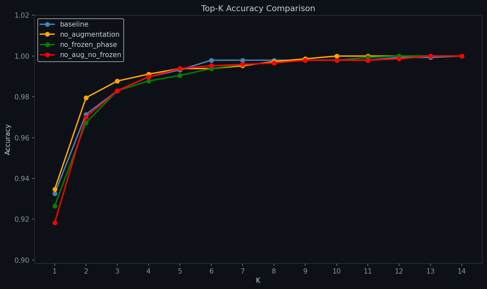
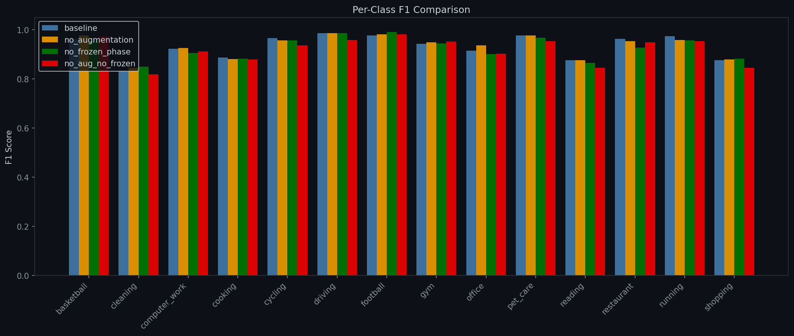
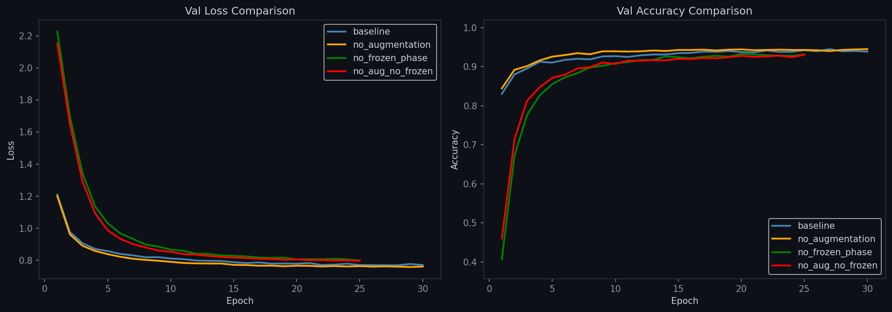

# VM.AI — Image-to-Prompt Training

Trains an EfficientNet-B4 classifier for 14 activity categories using a two-phase strategy with weighted loss and early stopping.

---

## Training Script

**File:** `src/image_to_prompt/training/train_classifier.py`

### Configuration

| Parameter | Value |
|-----------|-------|
| Model | EfficientNet-B4 (pretrained) |
| Image size | 380×380 |
| Batch size | 32 |
| Label smoothing | 0.1 |
| Optimizer | AdamW |
| Weight decay | 1×10⁻⁴ |
| Scheduler | CosineAnnealingLR (eta_min=1×10⁻⁶) |
| Early stopping min_delta | 0.001 |
| `num_workers` | 2 |
| `pin_memory` | True (when CUDA) |
| AMP | `GradScaler()` (when CUDA) |
| `data_root` | `data/image_to_prompt/final` |
| `save_path` | `models/efficientnet_b4_classifier/efficientnet_b4_classifier.pth` |
| `device` | auto (CUDA or CPU) |

### Two-Phase Strategy

**Phase A — Frozen backbone (5 epochs)**
- Backbone frozen, only classifier head trained.
- Learning rate: 1×10⁻³ (head only).

**Phase B — Partial unfreeze (25 epochs)**
- Last 2 blocks (`blocks[-2:]`) + classifier unfrozen.
- Learning rates: head 1×10⁻⁴, backbone 1×10⁻⁵.
- Cosine annealing over 25 epochs.
- Early stopping (patience=7, min_delta=0.001).

### Weighted Loss

Class weights are recomputed to compensate for the smaller `cleaning` category:

| Class | Count | Weight |
|-------|-------|--------|
| basketball | 700 | 0.99 |
| cleaning | 673 | 1.03 |
| computer_work | 700 | 0.99 |
| cooking | 700 | 0.99 |
| cycling | 700 | 0.99 |
| driving | 700 | 0.99 |
| football | 700 | 0.99 |
| gym | 700 | 0.99 |
| office | 700 | 0.99 |
| pet_care | 700 | 0.99 |
| reading | 700 | 0.99 |
| restaurant | 700 | 0.99 |
| running | 624 | 1.11 |
| shopping | 700 | 0.99 |

Weights use inverse-frequency formula: `total / (n_classes × count)`.

### Usage

```bash
# Full training
uv run python src/image_to_prompt/training/train_classifier.py

# Resume from checkpoint with custom epoch counts
uv run python src/image_to_prompt/training/train_classifier.py \
    --resume models/efficientnet_b4_classifier/efficientnet_b4_classifier.pth \
    --epochs_frozen 3 --epochs_unfrozen 15
```

### Transforms

| Set | Transforms |
|-----|------------|
| Train | Resize(420) → RandomCrop(380) → RandomHorizontalFlip → RandomRotation(15) → ColorJitter → ToTensor → Normalize |
| Val/Test | Resize(380) → ToTensor → Normalize |

Normalization: ImageNet mean `[0.485, 0.456, 0.406]`, std `[0.229, 0.224, 0.225]`.

**Note:** When training on CPU the script prints a warning: `WARNING: Training on CPU — expected ~3 hours. Use a GPU for faster training.`

**Note:** `train_classifier.py` automatically runs test evaluation after training using the best saved checkpoint — it is not a separate step. Results are saved to `training_history.json`.

The best model (by `val_acc`) is always saved to the **same** file (`efficientnet_b4_classifier.pth`), overwriting on each improvement. There are no epoch-specific checkpoints.

---

## Ablation Study

**File:** `src/image_to_prompt/training/ablation_study.py`

Runs 4 experiments isolating the effect of data augmentation and the frozen pre-training phase.

### Experiments

| Experiment | Augmentation | Frozen Phase | Epochs |
|---|---|---|---|---|
| `baseline` | Yes | Yes (5 + 25) | 30 |
| `no_augmentation` | No | Yes (5 + 25) | 30 |
| `no_frozen_phase` | Yes | No (0 + 25) | 25 |
| `no_aug_no_frozen` | No | No (0 + 25) | 25 |

All experiments use the same hyperparameters (batch size 32, AdamW, cosine annealing, weighted loss).

### Usage

```bash
# Run all 4 experiments sequentially
uv run python src/image_to_prompt/training/ablation_study.py

# Run a single experiment only
uv run python src/image_to_prompt/training/ablation_study.py --experiment baseline
uv run python src/image_to_prompt/training/ablation_study.py --experiment no_augmentation
uv run python src/image_to_prompt/training/ablation_study.py --experiment no_frozen_phase
uv run python src/image_to_prompt/training/ablation_study.py --experiment no_aug_no_frozen
```

### Key Differences from Full Training

- **No early stopping** — all experiments run full epoch counts
- **No resume capability** — each experiment starts from scratch
- **`no_frozen_phase` unfreezes the entire backbone** (`model.blocks`), not just `blocks[-2:]`
- Comparison charts only generated when all 4 experiments run together

### Output

```
models/ablation/
  baseline/
    checkpoint.pth
    history.json
  no_augmentation/
  no_frozen_phase/
  no_aug_no_frozen/
  ablation_results.json              ← Summary of all 4

assets/image_classifier/ablation/
  baseline/
    confusion_matrix.png
    per_class_metrics.png
    topk_accuracy.png
    training_curves.png
  ... (per experiment)
  comparison_topk.png                ← All 4 overlaid
  comparison_per_class_f1.png
  comparison_training_curves.png
```


*All 4 ablation experiments compared*


*F1 per class for each experiment*


*Train/val loss and accuracy for each experiment*

---

## Cross-Validation

**File:** `src/image_to_prompt/training/cross_validation.py`

5-fold stratified cross-validation with a **locked test set**. Train+val are used for the 5 splits; each fold evaluates its best model on the held-out test set. All metrics and charts are aggregated across folds.

### Configuration

| Parameter | Value |
|-----------|-------|
| Folds | 5 |
| Split | Stratified (preserves class distribution) |
| Seed | 42 |
| Batch size | 32 |
| Epochs | 5 frozen + 25 unfrozen |
| Early stopping | Patience 7, min_delta 0.001 |
| Class weights | Recomputed per fold from training indices (dynamic via `np.bincount()`) |
| `num_workers` | 2 |
| `pin_memory` | True (when CUDA) |
| AMP | `GradScaler()` (when CUDA) |

### Usage

```bash
# Run all 5 folds sequentially
uv run python src/image_to_prompt/training/cross_validation.py

# Run a specific fold only
uv run python src/image_to_prompt/training/cross_validation.py --fold 1
```

### Output

```
models/cross_validation/
  fold_1/
    checkpoint.pth
    history.json
  fold_2/
  fold_3/
  fold_4/
  fold_5/
  cv_results.json                    ← Mean ± std + per-fold test results

assets/image_classifier/cross_validation/
  cv_accuracy_boxplot.png            ← Test accuracy per fold + mean ± std
  aggregated_confusion_matrix.png    ← All 5 folds combined
  aggregated_per_class_metrics.png   ← Mean F1 per class with error bars
```


*Test accuracy distribution across 5 folds (green=best, red=worst, orange dashed=mean)*


*All 5 folds combined*


*Mean F1 per class with error bars*

---

## Evaluation

**File:** `src/image_to_prompt/evaluation/evaluate_classifier.py`

Loads the best checkpoint and runs on the held-out test set.

### Usage

```bash
# Default: models/efficientnet_b4_classifier/efficientnet_b4_classifier.pth
uv run python src/image_to_prompt/evaluation/evaluate_classifier.py

# Override checkpoint
uv run python src/image_to_prompt/evaluation/evaluate_classifier.py --checkpoint path/to/model.pth
```

### Metrics

- **Top-1 accuracy**: overall correct / total
- **Per-class precision, recall, F1, support**
- **Macro / weighted F1**
- **Confusion matrix** heatmap
- **Per-class metrics** grouped bar chart
- **Top-K accuracy** curve

### Results

Actual test metrics are saved to `models/efficientnet_b4_classifier/evaluation_report.json`. See `evaluate_classifier.py` for the full metric computation logic.


*Predicted vs actual classes on the test set*


*Precision, recall, and F1 per category*


*Accuracy at each K from 1 to 14*

### Output

```
models/efficientnet_b4_classifier/
  evaluation_report.json             ← All metrics in JSON

assets/image_classifier/
  confusion_matrix.png
  per_class_metrics.png
  topk_accuracy.png
```

---

## Push / Pull Model

### Push

**File:** `src/image_to_prompt/evaluation/push_model_to_hf.py`

Uploads the `.pth` file, evaluation report, chart images, and auto-generates a model card README to Hugging Face Hub.

```bash
uv run python src/image_to_prompt/evaluation/push_model_to_hf.py
```

Requires `HF_TOKEN` and `HF_MODEL_REPO_ID` in `.env` (token **required** — raises `KeyError` if missing). `HF_MODEL_REPO_PRIVATE` defaults to `"true"` in code (`.env.example` uses `"false"`).

### Pull

**File:** `src/image_to_prompt/pull_model_hf.py`

Downloads the full model repo (`.pth`, report, charts, README) into `models/efficientnet_b4_classifier/`. Deletes existing directory first.

```bash
uv run python src/image_to_prompt/pull_model_hf.py
```

---

## Folder Structure

```
models/
  efficientnet_b4_classifier/
    efficientnet_b4_classifier.pth
    training_history.json
    evaluation_report.json
  ablation/
    baseline/
      checkpoint.pth
      history.json
    no_augmentation/
    no_frozen_phase/
    no_aug_no_frozen/
    ablation_results.json
  cross_validation/
    fold_1/
      checkpoint.pth
      history.json
    fold_2/
    fold_3/
    fold_4/
    fold_5/
    cv_results.json

assets/image_classifier/
  confusion_matrix.png
  per_class_metrics.png
  topk_accuracy.png
  ablation/
    baseline/
      confusion_matrix.png
      per_class_metrics.png
      topk_accuracy.png
      training_curves.png
    no_augmentation/
    no_frozen_phase/
    no_aug_no_frozen/
    comparison_topk.png
    comparison_per_class_f1.png
    comparison_training_curves.png
  cross_validation/
    cv_accuracy_boxplot.png
    aggregated_confusion_matrix.png
    aggregated_per_class_metrics.png
```

---

## Source Files

| File | Purpose |
|------|---------|
| `src/image_to_prompt/training/train_classifier.py` | Two-phase training with early stopping + weighted loss |
| `src/image_to_prompt/training/ablation_study.py` | 4-experiment ablation (augmentation × frozen phase) |
| `src/image_to_prompt/training/cross_validation.py` | 5-fold stratified cross-validation |
| `src/image_to_prompt/evaluation/evaluate_classifier.py` | Test set evaluation with metrics + charts |
| `src/image_to_prompt/evaluation/push_model_to_hf.py` | Upload model + report + charts + README to HF |
| `src/image_to_prompt/pull_model_hf.py` | Download model from HF |
| `src/image_to_prompt/.env` | API keys and repo IDs (gitignored) |
| `src/image_to_prompt/.env.example` | Template for `.env` |
